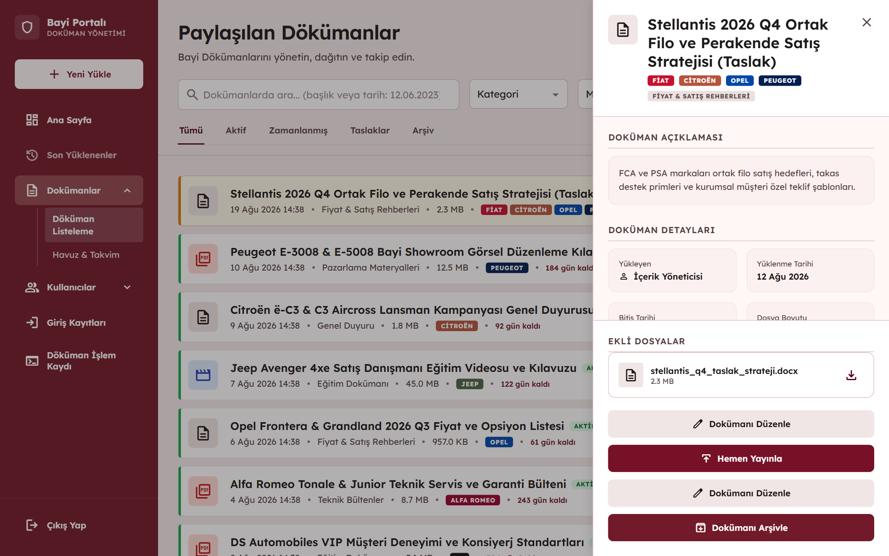
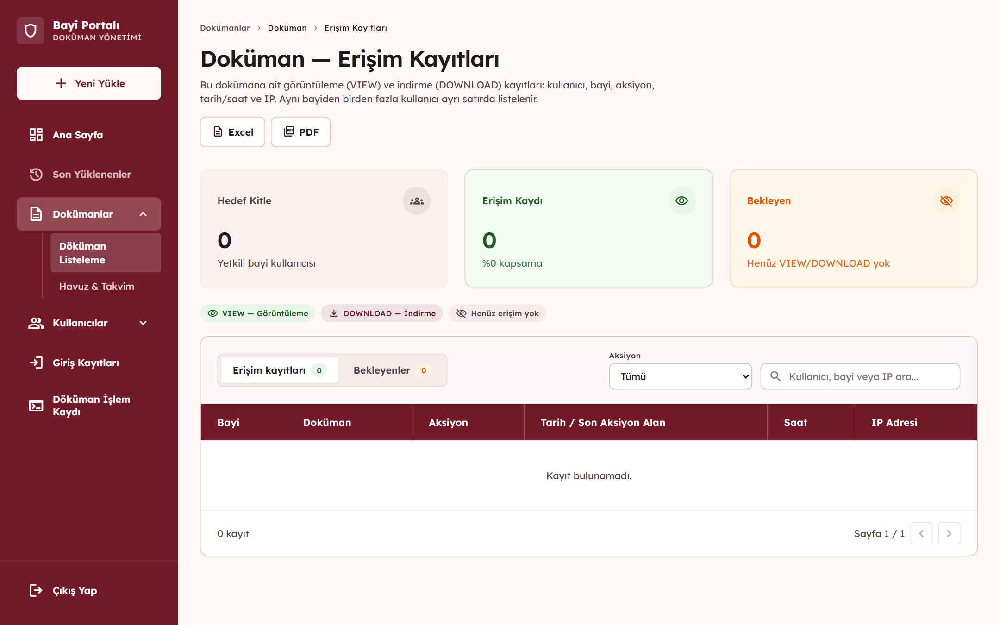

# 🏢 Kurumsal Bayi Doküman Yönetim Portalı

> **Staj Projesi — Tofaş IT**

Yetkili bayi kullanıcılarının kendilerine tanımlanan dokümanlara, duyurulara, eğitim materyallerine ve diğer kurumsal içeriklere merkezi ve kontrollü bir şekilde erişebilmesini sağlamak amacıyla geliştirilen web tabanlı **kurumsal doküman yönetim portalı**.

Uygulama; **Role-Based Authorization**, **JWT Authentication**, marka bazlı içerik yetkilendirme, doküman yaşam döngüsü yönetimi, dosya yönetimi ve erişim kayıtlarının tutulması gibi kurumsal uygulamalarda önemli olan işlevleri kapsamaktadır.

---

## ⚠️ Gizlilik ve Kaynak Kod Bilgilendirmesi

Bu proje, Tofaş bünyesindeki yazılım geliştirme stajım kapsamında geliştirilmiştir.

Kurumsal gizlilik, fikri mülkiyet ve şirket içi güvenlik gereklilikleri nedeniyle projenin **kaynak kodu, gerçek kurumsal verileri, şirket içi URL'leri, kimlik bilgileri ve yapılandırma dosyaları** kamuya açık olarak paylaşılmamaktadır.

Bu repository, projenin portföy amacıyla hazırlanmış **sanitize edilmiş (hassas bilgilerden arındırılmış) bir sunumudur.**

Repository içerisinde:

* Kaynak kodu
* Gerçek kullanıcı verileri
* Kurumsal dokümanlar
* Şirket içi bağlantılar
* Kimlik bilgileri veya şifreler
* Hassas sistem yapılandırmaları

bulunmamaktadır.

---

# 📌 Proje Hakkında

Projenin temel amacı, yetkili bayi kullanıcılarının kendileri için erişilebilir olan kurumsal dokümanlara tek bir platform üzerinden ulaşabilmesini sağlamaktır.

Sistem üç temel kullanıcı rolü üzerinden tasarlanmıştır:

### 👤 Administrator

Sistemin genel yönetiminden sorumludur.

* Kullanıcı yönetimi
* Bayi yönetimi
* Marka yönetimi
* Kategori yönetimi
* Doküman yönetimi
* Erişim kayıtlarının incelenmesi

gibi işlemleri gerçekleştirebilir.

### 📝 Content Manager

Kurumsal içeriklerin yönetiminden sorumludur.

* Doküman oluşturma
* Doküman yükleme
* Doküman güncelleme
* İçerik yayınlama
* Arşivleme

işlemlerini gerçekleştirebilir.

### 🏢 Dealer User

Bayi kullanıcılarının uygulamayı kullandığı roldür.

* Kendisine erişim yetkisi verilen içerikleri görüntüleme
* Dokümanları inceleme
* Yetkili olduğu dokümanları indirme
* İlgili duyuru ve bildirimleri takip etme

işlemlerini gerçekleştirebilir.

---

# 🎯 Temel İş Akışı

Uygulamanın temel çalışma mantığı aşağıdaki şekilde özetlenebilir:

```text
Kullanıcı Kimlik Doğrulama
          ↓
     Kullanıcı Rolü
          ↓
  Yetkilendirme Kontrolü
          ↓
Bayi - Marka İlişkisi
          ↓
Doküman - Marka İlişkisi
          ↓
Yetkili İçeriklerin Gösterilmesi
          ↓
   Erişim Kaydının Tutulması
```

Bu yapı sayesinde kullanıcının yalnızca sisteme giriş yapmış olması yeterli değildir. Kullanıcının ilgili kaynağa erişim yetkisinin de bulunması gerekir.

---

# ✨ Temel Özellikler

## 🔐 Kimlik Doğrulama ve Yetkilendirme

* JWT tabanlı Authentication
* Role-Based Authorization
* Yetkili kullanıcıların sisteme giriş yapabilmesi
* Kullanıcı rolüne göre farklı arayüz ve işlemlerin sunulması
* Backend tarafında yetkilendirme kontrolleri
* Aktif / pasif kullanıcı yönetimi

---

## 📄 Doküman Yönetimi

* Doküman yükleme
* Doküman metadata yönetimi
* Kategori bazlı doküman yönetimi
* Marka bazlı içerik hedefleme
* Doküman durum yönetimi
* Arşivleme
* Soft Delete
* Yetkili dokümanların indirilmesi

---

## 🏷️ Marka Bazlı İçerik Yetkilendirme

Sistemde her bayi kullanıcısının bütün dokümanlara erişmesi beklenmemektedir.

Bir dokümanın hangi bayiler tarafından görüntülenebileceği, bayi ile marka arasındaki ilişki ve dokümanın ilişkilendirildiği markalar üzerinden belirlenmektedir.

Basitleştirilmiş yapı:

```text
Bayi
 ↓
DealerBrand
 ↓
Yetkili Markalar
 ↓
MaterialBrand
 ↓
Doküman
```

Örneğin bir bayi belirli markalarla ilişkilendirilmişse, yalnızca bu markalara yönelik olarak yayınlanan dokümanlara erişebilir.

Bu yapı, içeriklerin kullanıcıya yalnızca ihtiyaç duyduğu ve yetkili olduğu kapsamda sunulmasını sağlar.

---

## 📊 Erişim Kayıtları ve Audit

Sistem üzerinde gerçekleştirilen belirli doküman işlemleri kayıt altına alınabilmektedir.

Örneğin:

* Doküman görüntüleme
* Doküman indirme
* Kullanıcı
* Erişim zamanı
* İlgili doküman

gibi bilgiler üzerinden bir **audit trail** oluşturulmaktadır.

Bu yapı, kurumsal uygulamalarda önemli olan **izlenebilirlik (traceability)** ihtiyacını karşılamaya yardımcı olur.

---

# 🖥️ Uygulama Ekranları

## 🏢 Bayi Portalı

### 🔐 Giriş Ekranı

Yetkili bayi kullanıcılarının sisteme kimlik doğrulama gerçekleştirerek giriş yaptığı ekran.


---

### 🏠 Bayi Ana Sayfası

Kullanıcı sisteme giriş yaptıktan sonra kendisi için hazırlanan ana sayfaya yönlendirilir.

Bu ekran üzerinden güncel içeriklere ve uygulamadaki temel işlevlere erişilebilir.


---

### 📄 Dokümanlar

Bayi kullanıcılarının erişim yetkileri dahilindeki dokümanları görüntüleyebildiği ana doküman yönetim ekranıdır.

Dokümanlar kullanıcıya tanımlanan yetkilendirme kuralları doğrultusunda listelenmektedir.


---

### 🔔 Bildirimler

Kullanıcıların kendileriyle ilişkili duyuru ve bildirimleri takip edebildiği ekran.


---

# 🛠️ Yönetim Paneli

Uygulamada sistem yöneticileri ve içerik yöneticileri için ayrı bir yönetim arayüzü bulunmaktadır.

## 📊 Yönetim Paneli

Yönetim paneli üzerinden sistemdeki içerik ve kullanıcılarla ilgili genel bilgiler takip edilebilmektedir.


---

## 📚 Doküman Yönetimi

Yöneticiler ve içerik yöneticileri, dokümanları merkezi bir arayüz üzerinden yönetebilmektedir.

Dokümanlar filtrelenebilir, incelenebilir ve ilgili markalarla ilişkilendirilebilir.


---

## 📑 Doküman Detayları

Yönetici, seçilen dokümana ait metadata bilgilerini inceleyebilir ve ilgili yönetim işlemlerini gerçekleştirebilir.



---

## 📊 Doküman Erişim Raporu

Sistemdeki doküman erişimlerinin takip edilebilmesi amacıyla erişim kayıtları görüntülenebilmektedir.

Bu ekran üzerinden doküman kullanımına ilişkin audit verileri incelenebilir.



---

# 🧩 Yönetim ve Audit Ekranları

Yönetim paneli içerisinde ayrıca:

* Kullanıcı yönetimi
* Bayi yönetimi
* Marka yönetimi
* Kategori yönetimi
* Login activity
* Access logs

gibi sistem yönetimi ve izleme ekranları bulunmaktadır.

Bu ekranlar sayesinde sistem yöneticilerinin uygulamadaki temel tanımları yönetmesi ve kullanıcı aktivitelerini takip etmesi sağlanmaktadır.

---

# 🏗️ Sistem Mimarisi

Uygulama, **Modular Monolith (Modüler Monolit)** yaklaşımı ve **Clean Architecture** prensipleri doğrultusunda yapılandırılmıştır.

Proje mikroservis mimarisinde değildir. Uygulama tek bir deploy edilebilir uygulama içerisinde, sorumlulukların birbirinden ayrıldığı modüler bir yapı kullanmaktadır.

Genel mimari yaklaşım:

```text
┌──────────────────────────────────────┐
│             Angular                  │
│                                      │
│ Components • Services • Guards       │
│ Interceptors • Models                │
└──────────────────┬───────────────────┘
                   │
              HTTP / JWT
                   │
                   ▼
┌──────────────────────────────────────┐
│        ASP.NET Core Web API           │
│                                      │
│ Controllers • Services               │
│ Authentication • Authorization       │
│ Swagger / OpenAPI                    │
└──────────────────┬───────────────────┘
                   │
                   ▼
┌──────────────────────────────────────┐
│         Clean Architecture           │
│                                      │
│ Core → Application → Infrastructure  │
└──────────────────┬───────────────────┘
                   │
             ┌─────┴─────┐
             ▼           ▼
      ┌────────────┐ ┌──────────────┐
      │ PostgreSQL │ │ File Storage │
      │            │ │              │
      │ Metadata   │ │ Binary Files │
      └────────────┘ └──────────────┘
```

---

# 🧱 Backend Mimarisi

Backend tarafında temel sorumluluklar farklı katmanlara ayrılmıştır.

```text
Core
 │
 ├── Entities
 ├── Enums
 └── Domain Exceptions
       │
       ▼
Application
 │
 ├── Business Logic
 ├── DTOs
 ├── Validation
 └── Use Cases
       │
       ▼
Infrastructure
 │
 ├── Entity Framework Core
 ├── PostgreSQL
 ├── Repositories
 ├── Migrations
 └── File I/O
       │
       ▼
API
 │
 ├── Controllers
 ├── Middleware
 ├── JWT
 ├── Dependency Injection
 └── Swagger / OpenAPI
```

Bu yaklaşımda Controller katmanının mümkün olduğunca ince tutulması ve iş kurallarının Application katmanında konumlandırılması hedeflenmiştir.

Infrastructure katmanı ise veritabanı, dosya sistemi ve diğer dış bağımlılıklarla iletişimden sorumludur.

---

# 🌐 Frontend Mimarisi

Frontend tarafında **Angular** kullanılmış ve uygulama sorumluluklarına göre organize edilmiştir.

Genel yapı:

```text
frontend
│
├── core
│   ├── guards
│   ├── interceptors
│   ├── services
│   └── models
│
├── features
│   ├── auth
│   ├── materials
│   └── admin
│
└── shared
    └── reusable components
```

Angular tarafındaki **Route Guard** yapıları kullanıcıların yetkileri dışındaki sayfalara erişmesini engellemek için kullanılmıştır.

Ancak güvenlik açısından kritik yetkilendirme kontrolleri yalnızca frontend'e bırakılmamış, backend API tarafında da uygulanmıştır.

---

# 🛠️ Teknoloji ve Araçlar

## Frontend

* Angular
* TypeScript
* HTML
* SCSS

## Backend

* .NET 9
* ASP.NET Core Web API
* Entity Framework Core
* REST API

## Database

* PostgreSQL
* Npgsql
* Entity Framework Core Migrations

## Authentication & Authorization

* JWT Authentication
* Role-Based Authorization

## API

* Swagger
* OpenAPI

## Containerization & Development

* Docker
* Docker Compose
* Git
* Figma

---

# 🗄️ Veritabanı Modeli

Uygulamanın veri modeli; kullanıcılar, bayiler, markalar, kategoriler, materyaller ve erişim kayıtları arasındaki ilişkileri temsil edecek şekilde tasarlanmıştır.

Temel ilişkiler basitleştirilmiş olarak:

```text
Users
 │
 ├──────────────► Dealers
 │                    │
 │                    ▼
 │              DealerBrands
 │                    │
 │                    ▼
 │                  Brands
 │                    ▲
 │                    │
 │              MaterialBrands
 │                    │
 │                    ▼
Categories ───────► Materials
                       │
                       ▼
                  AccessLogs
                       ▲
                       │
                     Users
```

Özellikle bayi-markalar ve materyal-markalar arasındaki **many-to-many** ilişkiler, içerik yetkilendirme mekanizmasının temelini oluşturmaktadır.

---

# 🔒 Güvenlik Yaklaşımı

Uygulamanın farklı katmanlarında güvenlik prensipleri dikkate alınmıştır.

### JWT Authentication

Kullanıcı kimlik doğrulamasının ardından API isteklerinde kullanılmak üzere JWT tabanlı authentication mekanizması kullanılmaktadır.

### Role-Based Authorization

Kullanıcının yalnızca sisteme giriş yapmış olması erişim için yeterli değildir.

Kullanıcının sahip olduğu role göre gerçekleştirebileceği işlemler belirlenmektedir.

### Backend Authorization

Frontend tarafındaki route kontrolleri kullanıcı deneyimini ve navigasyonu düzenlemek için kullanılırken, güvenlik açısından kritik yetkilendirme kontrolleri backend API tarafında uygulanmaktadır.

### DTO Kullanımı

API response'larında entity'lerin doğrudan dışarıya açılması yerine **DTO (Data Transfer Object)** yapıları kullanılarak istemciye gönderilecek veri kontrol altında tutulmaktadır.

Bu sayede örneğin:

* Password Hash
* Server-side File Path
* Internal database fields

gibi istemci tarafından bilinmemesi gereken alanların API response'larında açığa çıkması engellenmektedir.

### Dosya Yönetimi

Dosyanın binary içeriği ile dokümana ait metadata birbirinden ayrılmıştır.

```text
PostgreSQL
     │
     └── Doküman Metadata
          ├── FileName
          ├── StoredFileName
          ├── Extension
          └── MIME Type

File Storage
     │
     └── Binary File
```

### Soft Delete / Arşivleme

Dokümanların fiziksel olarak silinmesi yerine durumlarının değiştirilmesi ve arşivlenmesi desteklenmektedir.

Bu yaklaşım, veri kaybını azaltırken geçmiş kayıtların korunmasına yardımcı olur.

---

# 👩🏻‍💻 Projedeki Katkım

Projenin geliştirilmesi sırasında ağırlıklı olarak **Backend Development** alanında görev aldım. Bununla birlikte uygulamanın genel geliştirme sürecine ve frontend tarafındaki çalışmalara da katkı sağladım.

Başlıca sorumluluklarım:

* RESTful API geliştirme
* Backend business logic geliştirme
* Entity Framework Core kullanımı
* PostgreSQL ile çalışma
* Veritabanı ilişkilerinin tasarlanması
* JWT tabanlı Authentication mekanizmasının geliştirilmesi
* Role-Based Authorization
* Permission / erişim kontrol mekanizmasının geliştirilmesi
* Doküman yükleme ve indirme süreçlerinin geliştirilmesi
* Doküman erişim kayıtlarının oluşturulması
* Swagger üzerinden API testleri
* Docker ve PostgreSQL geliştirme ortamının kullanılması
* Veritabanı ve uygulama mimarisi kararlarına katkı sağlanması
* Frontend geliştirme süreciyle koordineli çalışma

---

# 🧠 Karşılaşılan Mühendislik Problemleri

## 1. Marka Bazlı İçerik Yetkilendirme

Projedeki önemli problemlerden biri, bir bayi kullanıcısının yalnızca yetkili olduğu markalara ait dokümanları görebilmesini sağlamaktı.

Basitleştirilmiş yetkilendirme akışı:

```text
User
 ↓
Dealer
 ↓
DealerBrands
 ↓
Authorized Brands
 ↓
MaterialBrands
 ↓
Accessible Materials
```

Bu nedenle yalnızca kullanıcının sisteme giriş yapıp yapmadığını kontrol etmek yeterli değildi.

Kullanıcının bağlı olduğu bayi, bayinin yetkili olduğu markalar ve dokümanın hedeflediği markalar birlikte değerlendirilerek erişim kararı oluşturuldu.

---

## 2. Dosya Yönetimi

Dokümanların binary verilerinin doğrudan PostgreSQL içerisinde tutulması yerine dosya içeriği ile metadata birbirinden ayrıldı.

Bu yapı:

* Veritabanı boyutunun kontrol edilmesi
* Dosya sisteminin bağımsız yönetilebilmesi
* Dosya metadata bilgilerinin ilişkisel olarak tutulabilmesi
* Fiziksel dosya yollarının API response'larında açığa çıkmaması

gibi avantajlar sağladı.

---

## 3. Farklı Kullanıcı Rollerinin Yönetilmesi

Sistem içerisinde farklı sorumluluklara sahip kullanıcıların bulunması nedeniyle her kullanıcı için aynı erişim modelinin kullanılması uygun değildi.

```text
Administrator
 │
 ├── User Management
 ├── Dealer Management
 ├── Brand Management
 ├── Content Management
 └── Audit / Reporting


Content Manager
 │
 ├── Content Creation
 ├── Publishing
 └── Archiving


Dealer User
 │
 ├── Content Discovery
 ├── Document Viewing
 └── Document Download
```

Bu nedenle hem frontend navigasyonu hem de backend authorization mekanizmaları kullanıcı rollerine göre yapılandırıldı.

---

## 4. Auditability ve İzlenebilirlik

Kurumsal bir doküman yönetim sisteminde yalnızca dokümanı sunmak yeterli değildir.

Dokümana kimin eriştiğinin ve hangi işlemi gerçekleştirdiğinin takip edilebilmesi de önemlidir.

Bu nedenle görüntüleme ve indirme gibi işlemlerin kayıt altına alınabileceği bir **Access Log** mekanizması oluşturuldu.

---

# 📚 Kazanımlarım

Bu proje, kurumsal yazılım geliştirme süreçlerini uygulamalı olarak deneyimlediğim önemli çalışmalardan biri oldu.

Proje boyunca özellikle aşağıdaki konularda pratik deneyim kazandım:

* Clean Architecture
* Modular Monolith
* ASP.NET Core
* .NET 9
* REST API Development
* Entity Framework Core
* PostgreSQL
* Relational Database Design
* JWT Authentication
* Role-Based Authorization
* Permission Management
* Angular
* Docker
* Docker Compose
* File Management
* Access Logging
* API Testing
* Git ile ekip çalışması
* Kurumsal uygulama geliştirme

Bunun yanında, kurumsal yazılım geliştirmenin yalnızca özellik geliştirmekten ibaret olmadığını; **mimari, güvenlik, yetkilendirme, veri bütünlüğü, sürdürülebilirlik ve izlenebilirliğin** de uygulamanın önemli parçaları olduğunu deneyimledim.

---

# 🎯 Temel Çıkarımlar

Bu proje sayesinde bir yazılım uygulamasını yalnızca kullanıcı arayüzü ve API'lerden oluşan bir sistem olarak değil, farklı sorumlulukların bir arada çalıştığı bir **enterprise application** olarak değerlendirmeyi öğrendim.

Özellikle:

```text
Clean Architecture
       +
Authentication
       +
Authorization
       +
Database Design
       +
File Management
       +
Audit Logging
       +
Role-Based Access Control
       ↓
Maintainable Enterprise Application
```

yapılarının bir araya gelerek sürdürülebilir ve güvenli bir kurumsal uygulama oluşturmadaki rolünü uygulamalı olarak deneyimledim.

---

# 📌 Proje Bilgileri

| Özellik                | Detay                                          |
| ---------------------- | ---------------------------------------------- |
| **Proje Türü**         | Kurumsal Web Uygulaması                        |
| **Geliştirme Bağlamı** | Yazılım Geliştirme Stajı                       |
| **Mimari**             | Modular Monolith + Clean Architecture          |
| **Frontend**           | Angular                                        |
| **Backend**            | ASP.NET Core / .NET 9                          |
| **Veritabanı**         | PostgreSQL                                     |
| **ORM**                | Entity Framework Core                          |
| **Authentication**     | JWT                                            |
| **Authorization**      | Role-Based Authorization                       |
| **API Dokümantasyonu** | Swagger / OpenAPI                              |
| **Containerization**   | Docker / Docker Compose                        |
| **Kaynak Kodu**        | Kurumsal gizlilik nedeniyle paylaşılmamaktadır |

---

> **Not:** Bu repository'deki görseller ve teknik açıklamalar portföy amacıyla hazırlanmış olup kurumsal kaynak kod, gerçek kullanıcı verileri veya gizli şirket bilgileri içermemektedir.

---

### 👩🏻‍💻 Geliştirildiği Bağlam

**Software Engineering Internship — Tofaş IT**

Bu proje, kurumsal bir yazılım geliştirme ortamında ekip çalışması içerisinde geliştirilmiştir.
